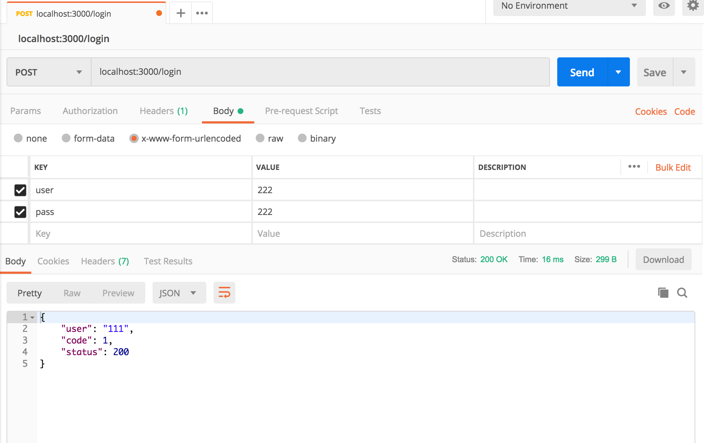

# koa2+vue
* 用vue-cli搭建前端项目
* 用koa2搭建后台，给前端提供数据访问接口

## 项目结构
 

* 用vue-cli 搭建的项目，红色框中是新建的文件夹用于存放koa
* 剩下的文件在写项目中慢慢增加，最初就是这样的
* 之后将项目跑起来，看一下有没有问题（这里就当作没有问题）

# 前端
* 这里选用Element-ui和vue搭配
* 这里采用的是element-UI的完整引入，如果小伙伴想用按需加载的话 参考[按需引入](http://element-cn.eleme.io/#/zh-CN/component/quickstart)
* 登陆页面就不介绍了 大家可以直接用（components/login.vue）

```
安装element-ui
    npm i element-ui -S
    
在src/main.js中引入
    import ElementUI from 'element-ui';
    import 'element-ui/lib/theme-chalk/index.css';
    Vue.use(ElementUI);
```

## 登陆
* 安装axios用于前后台的数据传输 `npm install --save axios`
* 在main.js中配置全局的axios
* 在src下新建一个axios文件夹，配置拦截器 和 全局地址 token 

```
import axios from 'axios' // axios引用
import qs from 'qs'

// axios.defaults.baseURL = 'http://localhost:3000'; // 全局的地址，因为我的koa监听端口是3000， 这里可以按照大家自己的来配置
// axios.defaults.headers.common['Authorization'] = AUTH_TOKEN;  //这是配置token
axios.defaults.headers.post['Content-Type'] = 'application/x-www-form-urlencoded';
// 添加请求拦截器
axios.interceptors.request.use(function (config) {
  // 在发送请求之前做些什么
  if(config.method === 'post'){
    config.data = qs.stringify(config.data)
  }
  return config;
}, function (error) {
  // 对请求错误做些什么
  return Promise.reject(error);
});

// 添加响应拦截器
axios.interceptors.response.use(function (response) {
  // 对响应数据做点什么
  return response;
}, function (error) {
  // 对响应错误做点什么
  return Promise.reject(error);
});

export default axios;
```

* 在src下新建一个api文件夹，存放访问后台的地址 

```
import axios from 'axios';
export default{
  denglu: (data) => {
    return axios.post('/login', data)
  }
}
```
> 前端先告一段落，我们来配置后台接口

## 搭建koa2
学习[koa](https://koa.bootcss.com/)
* 安装koa2 koa-bodyparser koa-router koa2-cors  `npm install --save koa koa-bodyparser koa-router koa2-cors`

-------
* [x] koa-bodyparser  ：用于接收并解析前台发送过来的post数据
* [x] koa-router ：路由，
* [x] koa2-cors      ：用来解决前端的跨域

* 搭建koa 在浏览器运行localhost:3000 页面输出 hello 表示成功了 😄

    _下面的代码是验证koa是否搭建成功，可以跳过_

```
const Koa = require('koa');
const bodyparser = require('koa-bodyparser');
    
const app = new Koa();
    
app.use(async (ctx) => {
  ctx.body = 'hello';
})
    
app.listen(3000);
```

* 接下来 开始搭建koa的路由

```
const Koa = require('koa'); 
const bodyparser = require('koa-bodyparser');
const router = require('koa-router')();
const login = require('./router/login.js');     //这是登陆路由的文件
const cors = require('koa2-cors');
const app = new Koa();

这是处理前端跨域的配置
app.use(cors({
  origin: function (ctx) {
    if (ctx.url === '/login') {
      return "*"; // 允许来自所有域名请求
    }
    return 'http://localhost:8080';
  },
  exposeHeaders: ['WWW-Authenticate', 'Server-Authorization'],
  maxAge: 5,
  credentials: true,
  allowMethods: ['GET', 'POST', 'DELETE'],
  allowHeaders: ['Content-Type', 'Authorization', 'Accept'],
}));
    
router.use('/login',login);   //将路由提取出去便于管理
app
  .use(router.routes())
  .use(router.allowedMethods());
app.listen(3000);
```
* 接下来就是去配置登陆的路由

```
const router = require('koa-router')();

router
  .post('/', async ctx => {
    ctx.body = {  //这是向前台返回的数据 因为没有连接数据库所以我们自己定义，后面讲连接数据库
      user:'111',
      code:1,
      status:200
    };
  });

module.exports = router.routes();
```
* 接下来 进入src/axios下的文件打开 将注释的代码放开

``` 
axios.defaults.baseURL = 'http://localhost:3000'; // 全局的地址，因为我的koa监听端口是3000， 这里可以按照大家自己的来配置
```

### ok 我们开始测试一下
可以用postmain 也可以直接在浏览器中测试
> postmain
>>


> chrome浏览器 直接在浏览器中测试
>>  

-------
能取到数据 那就说明没有问题
接下来开始连接数据库 数据库用的是 ***mysql***